# Microservices App Deployment on AWS EKS
This is a guide that provides a step-by-step instructions for deploying a micro-service application on AWS Elastic Kubernetes Service (ESK). In this case, my project name is **Sock-Shop**

## Projects Requirements
- Cloud Provider Account - Azure used
- Azure CLI
- Terraform
- Kubectl
- Helm
- Grafana
- Micro-service Application - Sock Shop
- CI/CD - Github Actions

## Project Structure
## Project Objective
This project is about deploying a microservices-based application using automated tools to ensure quick, reliable, and secure deployment on Kubernetes. By focusing on Infrastructure as Code, you'll create a reproducible and maintainable deployment process that leverages modern DevOps practices and tools.

### Steps to Deploy the Microservice Application
Ensure you have the following installed on your local machine:
- Git
- Azure CLI
- Helm
- Terraform

Using Terraform as an Infrastructure as a Code (IaaC) tool, create a `main.yml` file  to contain the deployment of your infrastructure in Azure. 

- Confuigure your terminal for AWS with `Azure configure`  and complete the prompt as required
- Initialize terraform in the same directory of your **main.tf**  with the command `terraform init`
- To preview the resources to be deployed, run `terraform plan`
- Run `terraform apply` to provision the resource on Azure platform.
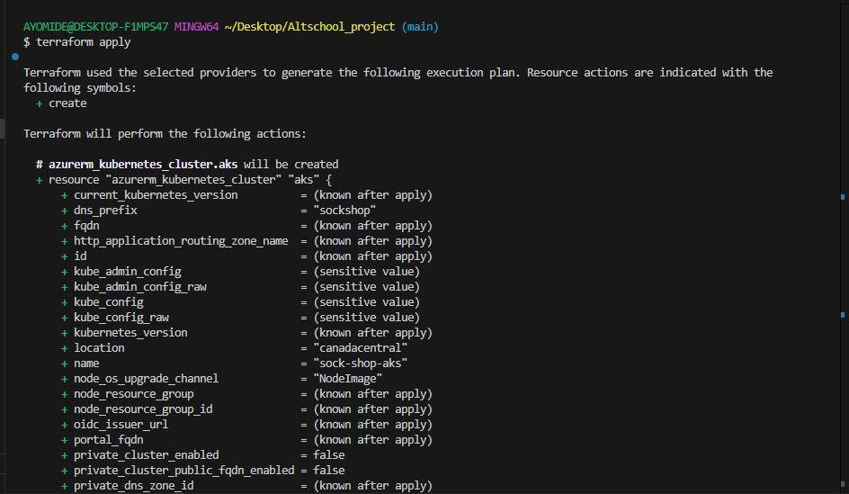
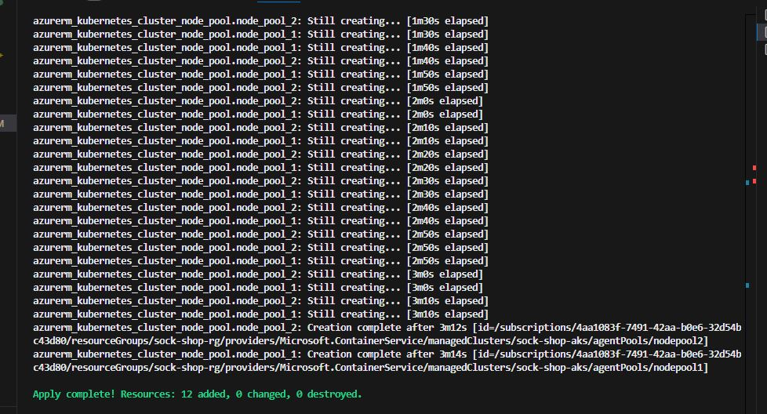
- Go to your Azure console to confirm the provisioned resource as shown in the image below
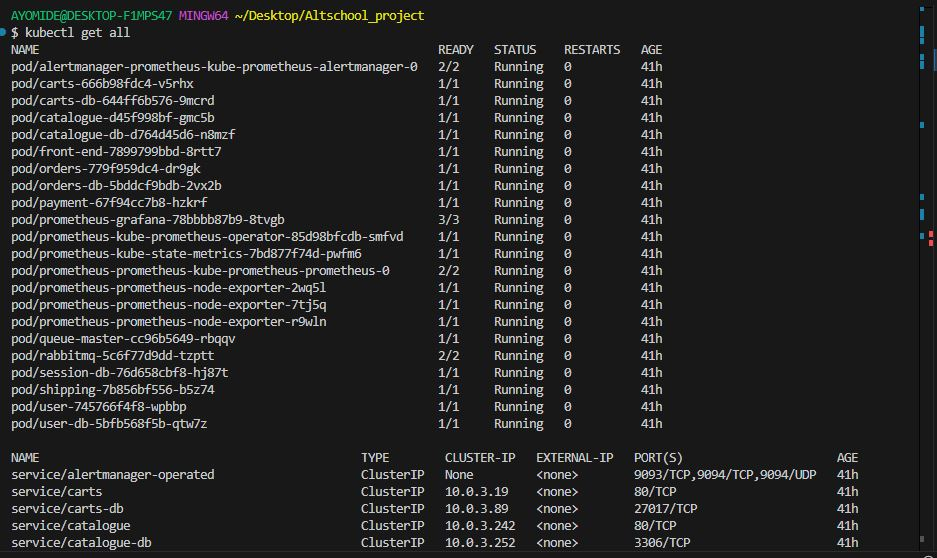

- Configure kubectl to use the new EKS cluster.
`aws eks update-kubeconfig --region us-east-1 --name sock-shop`
- `kubectl apply -f <yml-file-create-app-deployment>`
  
    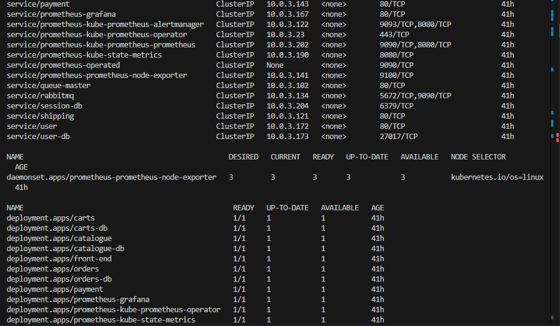
- Check your Azure console to view deployed app

- Configure your current directory to make your namespace default 

- To see all running deployment, pods and services, run `kubectl get all`
  
  
    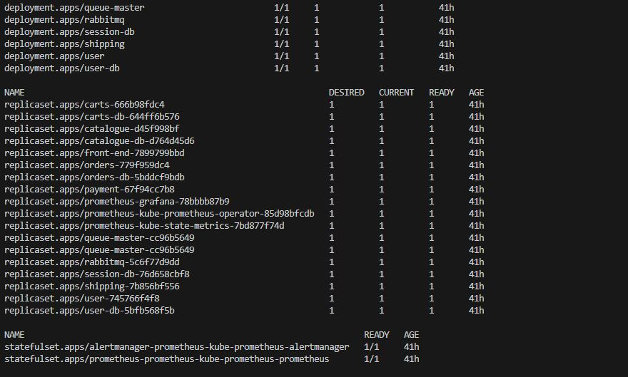
- After we confirm that our pods are running, we can now test the application by port-forwarding the service to our local machine using the following command `kubectl port-forward service/front-end -n sock-shop 30001:80`
 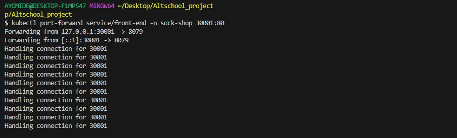
  

### Monitoring
- Prometheus will be used to monitor the performance and health of the Socks Shop application. This will include metrics such as request latency, error rate, and request volume. The Prometheus server will be configured to scrape metrics from the Socks Shop application and store them in a time-series database. Grafana will be used to visualize the metrics and create dashboards to monitor the performance and health of the application.

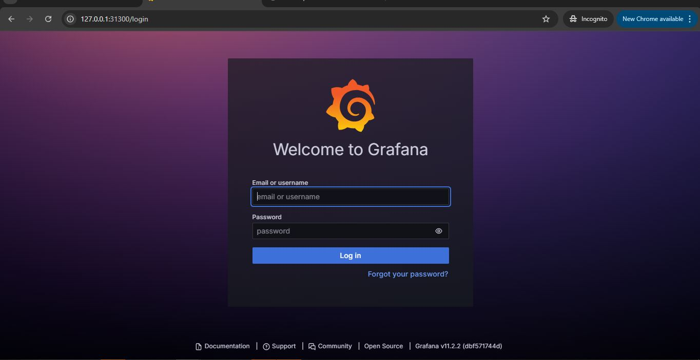
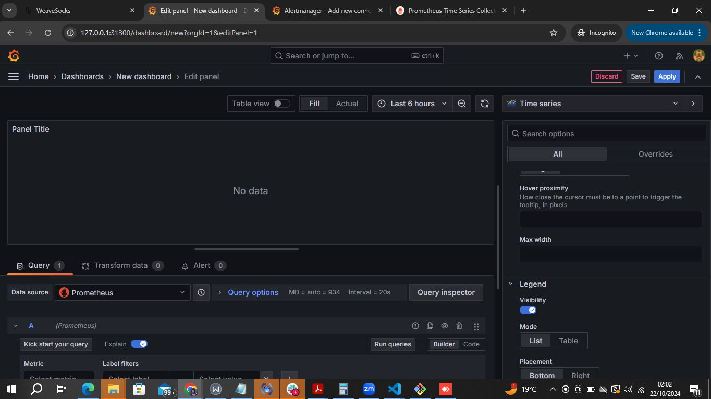
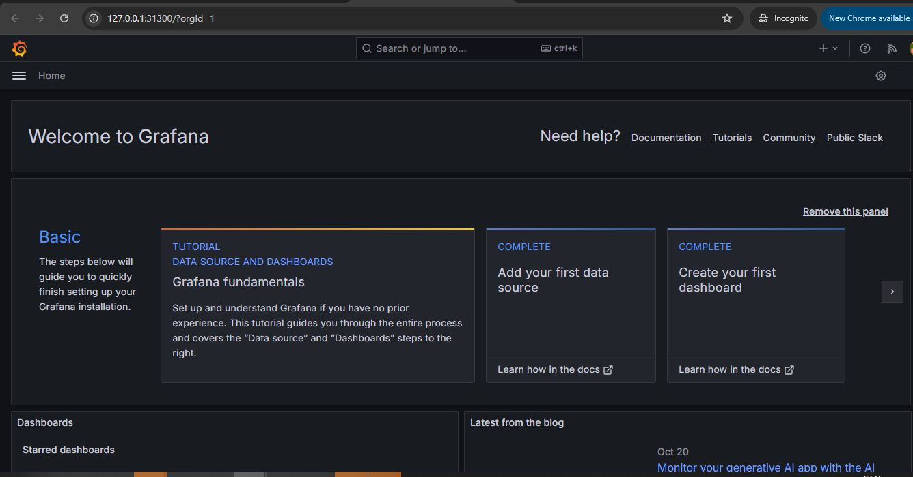
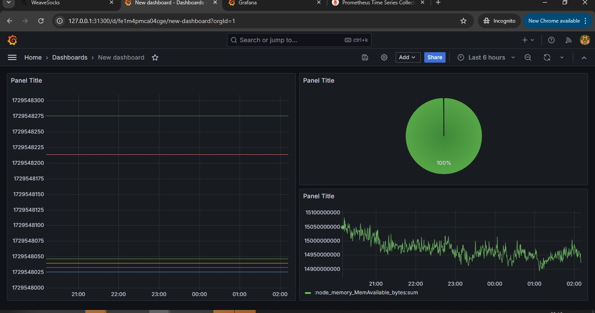

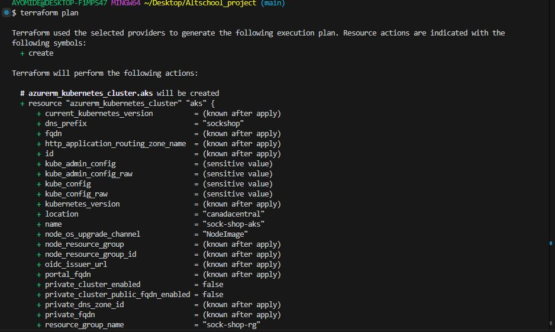
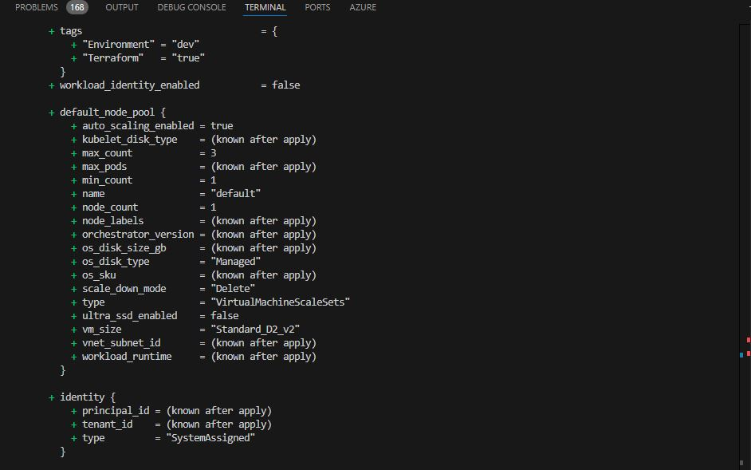
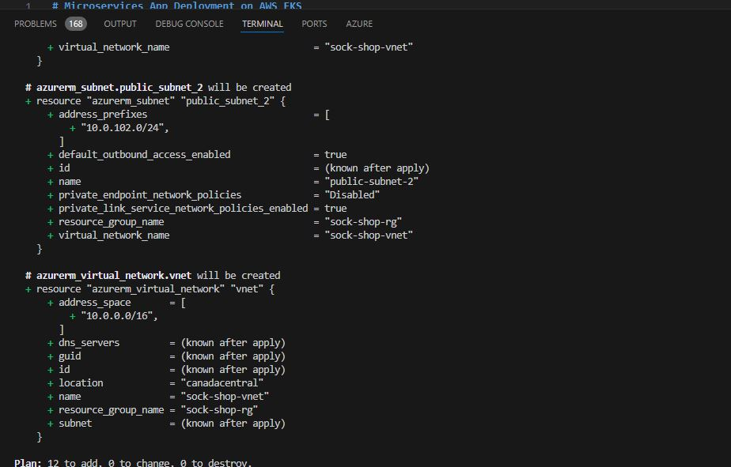

## Configuring App to Domain Name
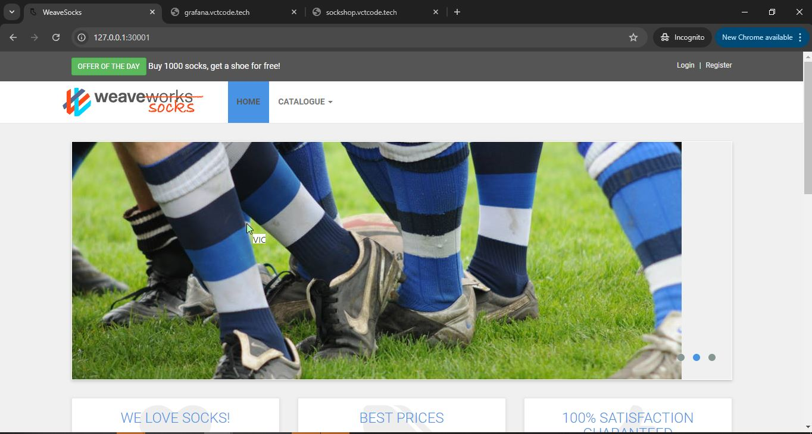

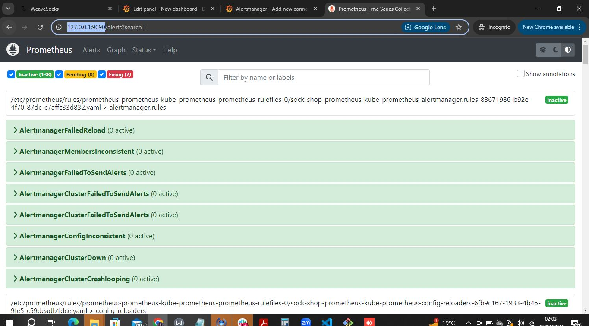

### Conclusion:
- This project has provide hands-on experience with Infrastructure as Code, Kubernetes, DevOps best practices, and cloud security. It also demonstrate the value of automation and monitoring in ensuring the reliability and performance of microservices-based applications. By the end of the project, I have a fully functional deployment pipeline for the Socks Shop application, including infrastructure provisioning, monitoring, logging, and security.

